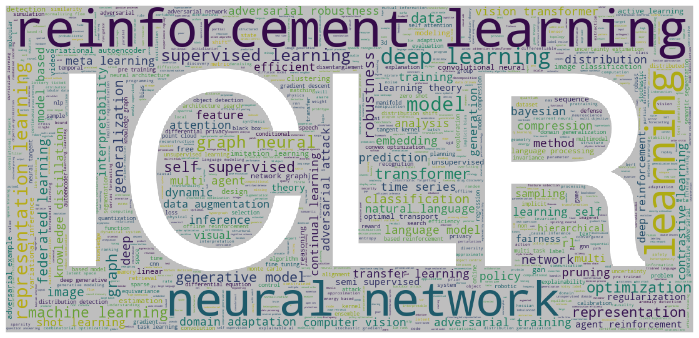
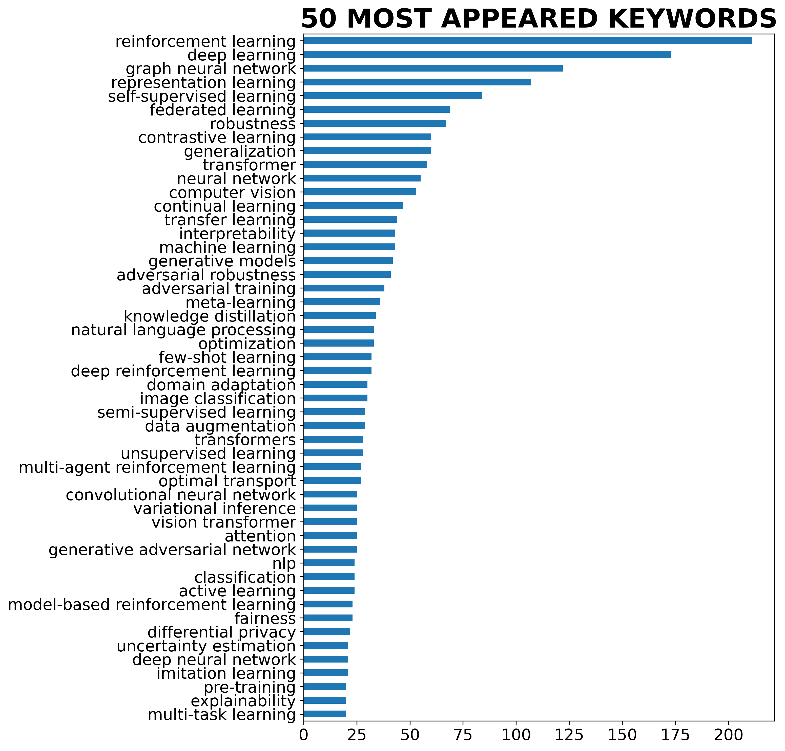
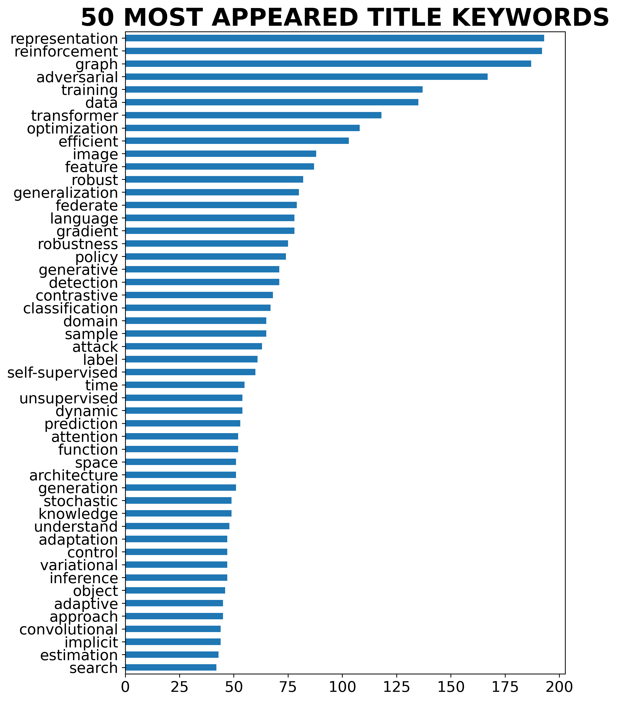
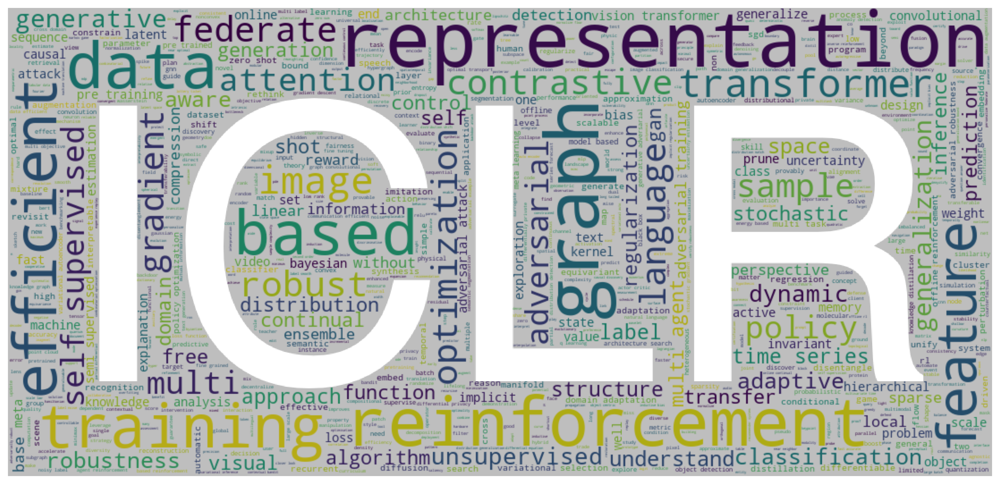

# Visualize ICLR 2022 OpenReview Data

ICLR 2022 Paper submission analysis from https://openreview.net/group?id=ICLR.cc/2022/Conference

<p align="center">
    
</p>

## Requirements
+ Install requirements
```bash
pip install wordcloud nltk pandas imageio selenium tqdm
```
+ Download nltk packages for language processing
```python
import nltk
nltk.download('punkt')
nltk.download('averaged_perceptron_tagger')
nltk.download('wordnet')
nltk.download('stopwords')

```
+ If you got anything wrong when calling `webdriver.Edge('msedgedriver.exe')`, you can 

    - Delete `msedgedriver.exe` since it may only work on my computer (Windows 10)

    - [*Install Microsoft Edge (Chromium)*](https://docs.microsoft.com/en-us/microsoft-edge/webdriver-chromium?tabs=python#install-microsoft-edge-chromium): *Ensure you have installed [Microsoft Edge (Chromium)](https://www.microsoft.com/en-us/edge). To confirm that you have Microsoft Edge (Chromium) installed, go to `edge://settings/help` in the browser, and verify the version number is Version 75 or later*.
    - *Download Microsoft Edge Driver*: *Go to `edge://settings/help` to get the version of Edge.*
    - *Navigate to the [Microsoft Edge Driver downloads](https://developer.microsoft.com/microsoft-edge/tools/webdriver/#downloads) page and download the driver that matches the  Edge version number.*

   > From https://stackoverflow.com/questions/63529124/how-to-open-up-microsoft-edge-using-selenium-and-python

## Crawl Data
1. Run `crawl_paperlist.py` to crawl the list of papers (~0.5h).
   
## Paper List (3,407 submission in total)
`crawl_paperlist.py` only crawls 3,000 papers for some errors, but it has 3,407 submissions in total. The *full* paper list are as follows:
+ [sources/ICLR-2022.csv](./sources/ICLR-2022.csv)
+ [sources/ICLR-2022.md](./sources/ICLR-2022.md)

## Visualization
Keywords and Title

+ **Keywords Frequency**
The top 50 common keywords (uncased) and their frequency:

<p align="center">
    
</p>

+ **Keywords Cloud**
The word clouds formed by keywords of submissions show the hot topics including *deep learning*, *reinforcement learning*, *representation learning*, *graph neural network*, etc.

<p align="center">
    
</p>

+ **Title Keywords Frequency**
The top 50 common title keywords (uncased) and their frequency:

<p align="center">
    
</p>

+ **Title Keywords Cloud**
The word clouds formed by keywords of submission titles:

<p align="center">
    
</p>


## Acknowledgment
Inspired by this repo: https://github.com/evanzd/ICLR2021-OpenReviewData

